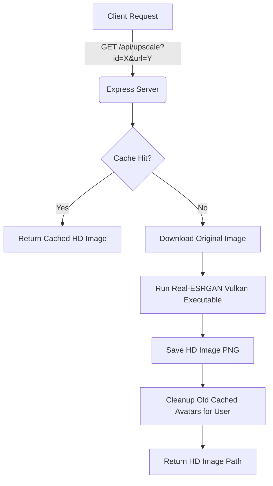

# Real-ESRGAN Image Upscaling System Integration

This document outlines the architecture, requirements, configuration, and integration code for the high-definition image upscaling system used in this project. The system leverages the **Real-ESRGAN** deep learning model compiled for Vulkan (NCNN) to run offline and upscale user avatars locally on Windows without consuming cloud APIs.

---

## 1. Architecture Overview



---

## 2. Prerequisites & Dependencies

To use this integration in another Node.js project:

1. **Express framework** (or any node HTTP server).
2. **Real-ESRGAN Vulkan Binary (`realesrgan-ncnn-vulkan.exe`)**:
   * Download the pre-compiled executable from the official repository: [xinntao/Real-ESRGAN-ncnn-vulkan](https://github.com/xinntao/Real-ESRGAN-ncnn-vulkan).
   * Place the contents (including models like `realesrgan-x4plus.bin` / `realesrgan-x4plus.param`) in a folder named `upscaler/` inside your project root.
3. **Graphics Card (Vulkan compatibility)**: Since this runs locally using Vulkan, it relies on GPU acceleration for faster processing.

---

## 3. Node.js Express Integration Code

Add this module/endpoints to your backend script (e.g., `server.js` or `app.js`).

### Helper: Extract MD5 Hash from URL
This helper generates a unique MD5 hash for the avatar URL, allowing caching. If a user changes their profile picture (generating a new URL), the hash changes, bypassing the cache.

```javascript
const path = require('path');
const fs = require('fs');

/**
 * Extracts a unique hash representing the image URL for caching
 */
function getAvatarUrlHash(url) {
  if (!url) return '';
  if (url.includes('avatares_hd/') && url.endsWith('.png')) {
    const baseName = path.basename(url, '.png');
    const parts = baseName.split('_');
    return parts[parts.length - 1];
  }
  let targetUrl = url;
  if (url.includes('/proxy-image') && url.includes('url=')) {
    try {
      const match = url.match(/[?&]url=([^&]+)/);
      if (match) {
        targetUrl = decodeURIComponent(match[1]);
      }
    } catch (e) {
      console.error('[Hash Extraction Error]', e);
    }
  }
  const cleanUrl = targetUrl.split('?')[0];
  return require('crypto').createHash('md5').update(cleanUrl).digest('hex').substring(0, 8);
}
```

### Express Endpoint: `/api/upscale`
This endpoint takes `url` and `id`, handles the download (following HTTP/HTTPS redirects), executes the Vulkan CLI model, and replaces previous cached files for the same user ID to prevent disk bloating.

```javascript
const { execFile } = require('child_process');

app.get('/api/upscale', async function (req, res) {
  let url = req.query.url || '';
  let id  = req.query.id  || '';

  if (!url || !id) {
    return res.json({ error: 'URL and ID are required' });
  }

  // Sanitize the ID to prevent path traversal vulnerability
  id = id.replace(/[^a-zA-Z0-9_]/g, '');

  console.log(`\n--- [Upscale Started] ID: ${id} ---`);
  console.log(`[Upscale] Original URL: ${url}`);

  const urlHash = getAvatarUrlHash(url);

  const tempFile   = path.join(__dirname, 'temp_upscale', `${id}_${urlHash}.png`);
  const outputFile = path.join(__dirname, 'avatares_hd',  `${id}_${urlHash}.png`);
  const outputUrl  = `avatares_hd/${id}_${urlHash}.png`;

  // Optional: check if an associated animated video already exists in the project
  const videoFile  = path.join(__dirname, 'avatares_video', `${id}_${urlHash}.mp4`);
  const videoUrl   = fs.existsSync(videoFile) ? `avatares_video/${id}_${urlHash}.mp4` : null;

  // Cache: If this specific image has already been upscaled, return it immediately
  if (fs.existsSync(outputFile)) {
    console.log(`[Upscale Cache Hit] Serving cache for ID: ${id} (${outputUrl})`);
    return res.json({ status: 'cached', url: outputUrl, videoUrl: videoUrl });
  }

  try {
    // Ensure working directories exist
    const tempDir = path.join(__dirname, 'temp_upscale');
    const hdDir   = path.join(__dirname, 'avatares_hd');
    if (!fs.existsSync(tempDir)) fs.mkdirSync(tempDir, { recursive: true });
    if (!fs.existsSync(hdDir))   fs.mkdirSync(hdDir,   { recursive: true });

    // Download original image file (handles 301/302 redirects)
    console.log(`[Upscale] Downloading original image to: ${tempFile}`);
    await new Promise((resolve, reject) => {
      const proto = url.startsWith('https') ? require('https') : require('http');
      const file  = fs.createWriteStream(tempFile);
      const req2  = proto.get(url, { headers: { 'User-Agent': 'Mozilla/5.0' } }, function (r) {
        if (r.statusCode === 301 || r.statusCode === 302) {
          file.close();
          const redirectUrl = r.headers.location;
          const proto2 = redirectUrl.startsWith('https') ? require('https') : require('http');
          proto2.get(redirectUrl, { headers: { 'User-Agent': 'Mozilla/5.0' } }, function (r2) {
            if (r2.statusCode !== 200) {
              file.close();
              try { fs.unlinkSync(tempFile); } catch (e) {}
              reject(new Error(`Redirect status code invalid: ${r2.statusCode}`));
              return;
            }
            r2.pipe(file);
            file.on('finish', resolve);
            file.on('error', reject);
          }).on('error', reject);
          return;
        }
        
        if (r.statusCode !== 200) {
          file.close();
          try { fs.unlinkSync(tempFile); } catch (e) {}
          reject(new Error(`Original status code invalid: ${r.statusCode}`));
          return;
        }

        r.pipe(file);
        file.on('finish', resolve);
        file.on('error', reject);
      });
      req2.on('error', reject);
      req2.setTimeout(15000, () => { req2.destroy(); reject(new Error('Download timeout')); });
    });

    // Check if download succeeded and file has size
    if (!fs.existsSync(tempFile) || fs.statSync(tempFile).size === 0) {
      console.error(`[Upscale Download Failed] ID: ${id}`);
      return res.json({ error: 'Failed to download original avatar' });
    }
    console.log(`[Upscale Download OK] ID: ${id} (${Math.round(fs.statSync(tempFile).size / 1024)} KB)`);

    // Path to the local Real-ESRGAN binary
    const exePath = path.join(__dirname, 'upscaler', 'realesrgan-ncnn-vulkan.exe');

    // Run Real-ESRGAN CLI
    console.log(`[Upscale Executing Real-ESRGAN] Processing model for ID: ${id}...`);
    await new Promise((resolve, reject) => {
      execFile(
        exePath, 
        ['-i', tempFile, '-o', outputFile, '-f', 'png'], 
        { timeout: 60000 },
        function (err, stdout, stderr) {
          if (err) { reject(err); return; }
          resolve();
        }
      );
    });

    // Cleanup the temporary original image
    try { fs.unlinkSync(tempFile); } catch(e) {}

    if (fs.existsSync(outputFile)) {
      // Cleanup older cached images of the same user ID to prevent filling up disk space
      try {
        const files = fs.readdirSync(hdDir);
        files.forEach(function (f) {
          if (f.startsWith(`${id}_`) && f !== `${id}_${urlHash}.png`) {
            try { fs.unlinkSync(path.join(hdDir, f)); } catch (_) {}
          }
        });
      } catch (e) {}

      console.log(`[Upscale Success] ID: ${id} | HD Image Saved: ${outputUrl} (${Math.round(fs.statSync(outputFile).size / 1024)} KB)`);
      return res.json({ status: 'success', url: outputUrl, videoUrl: videoUrl });
    } else {
      console.error(`[Upscale Failed] Real-ESRGAN did not produce output for ID: ${id}`);
      return res.json({ error: 'AI processing failed' });
    }

  } catch (e) {
    try { if (fs.existsSync(tempFile)) fs.unlinkSync(tempFile); } catch(_) {}
    console.error(`[Upscale Exception Error] ID: ${id} | Error: ${e.message}`);
    return res.json({ error: e.message });
  }
});
```

---

## 4. Troubleshooting & Settings

* **Vulkan Driver Errors**: If you get errors related to `-10` or `Vulkan library not loaded`, ensure your GPU drivers are up to date and support Vulkan API (integrated intel GPUs or dedicated Nvidia/AMD cards).
* **CLI Custom Parameters**:
  * `-i`: Input image path.
  * `-o`: Output image path.
  * `-s`: Scale factor (defaults to `4` for 4x scaling). You can reduce it to `2` or `3` to speed up processing time by editing arguments: `['-i', tempFile, '-o', outputFile, '-s', '2', '-f', 'png']`.
  * `-m`: Choose a model (e.g. `realesrgan-x4plus-anime` for drawing/illustrations). Defaults to the standard model.
